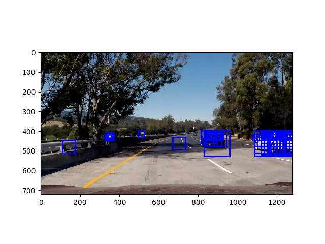

## HOG Histogram of Oriented Gradients
The HOG features extraction function is included in helper_functions.py in line 6.
The parameters are declared and defined in video_process.py line 18
The HOG function was tested using the provided images from Udacity github repo
Below is a sample image taken from the repo

Below is the above picture with HOG features extracted

HOG features was extracted by first converting the image into grayscale since HOG only accept one channel
After experimentation, the optimal parameters are as follow
- Orientation: 9
- Pixel per cell: 8
- Cell per block: 2

The result can be seen on the HOG image above, we can identify the shape of both cars easily

## Classifier
The classifiers used are SVM and CNN. The SVM and CNN were trained using the udacity small sets of vehicles and non vehicles. The SVM uses the rbf kernel, and all other parameters are left at default. The CNN is a mini inception model.

## Sliding Window
I used 3 different sized sliding windows. The intuition is the farther the object from the camera, the smaller it will be.
Thus, a smaller window is used to slide on the area closer to horizon. The window also only slides below the horizon (about half of the Y-axis image size), since we don't want a false positive in the sky.

Below is the original image taken from Udacity repo

Below is the image after sliding windows and SVM model has predicted for positive windows

As can be seen on the image above, there are a lot of overlapping between the 3 different sliding windows, therefore a heatmap approach was taken to identify false positives. Further, the result of the heatmap is fed into a CNN to further ensure that the window does contain a car. The CNN does a good job in predicting a car / not car. I am currently working to remove the SVM completely and just use CNN to classify the sliding window, it seems that CNN is indeed more robust than SVM.

## Video Implementation
After ensuring that my model can classify a static image, I tried the model to detect vehicles in the video. The model does predict nicely, however, one problem is that the bounding box is very wobbly. Therefore I tried to save several frames and compare them when drawing bounding boxes, it was unsuccessful, clearly because of my incompetence in implementing it :). A suggestion from a mentor (Patrick Kern, you deserve a shoutout) to use heatmap instead point me in the right direction. The heatmap was averaged and updated when new frames come into the function, and the resulting heatmap was used to draw the bounding box. It was a major improvement in the boxes drawn. The final video is included in this github repo, project_output.mp4

